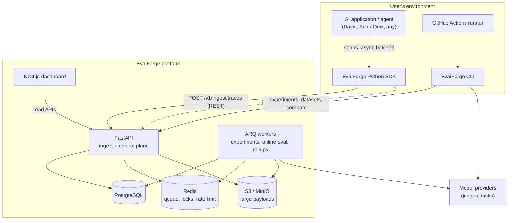
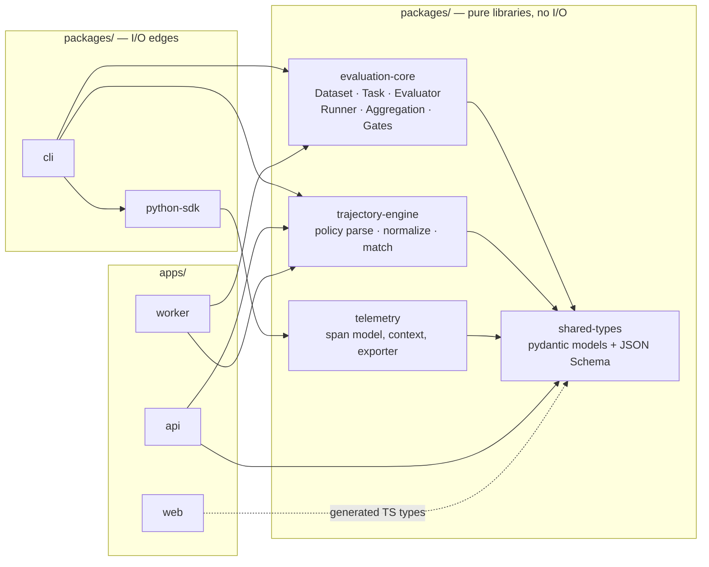
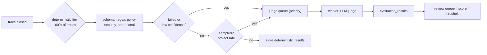
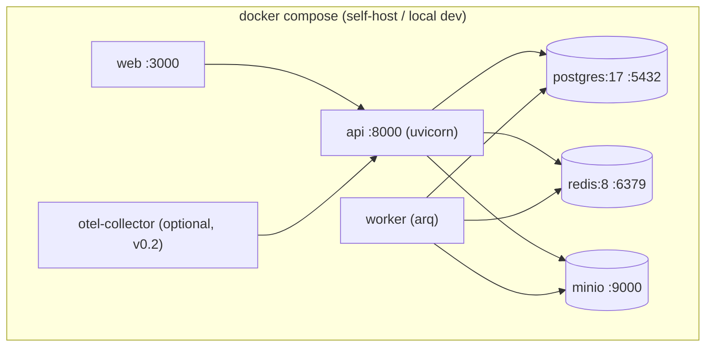

# EvalForge — Architecture

## 1. Guiding principles

1. **The pure core is a library, not a service.** `evaluation-core` and `trajectory-engine` have no I/O, no database, no HTTP, no knowledge of the API. They take data in and return results. This is what makes local mode, CI mode, server mode, and unit testing all the same code path.
2. **Local first.** Everything on the critical loop must work with `--local` and zero server. The server adds persistence, history, comparison, and sharing — not capability.
3. **Same verdict everywhere.** A policy or gate evaluated in the CLI and on the server must produce byte-identical results. Enforced by contract tests over golden fixtures.
4. **Immutability at the boundaries.** Dataset versions, evaluator versions, and experiment results are append-only. Reproducibility is a data-model property, not a convention.
5. **Ingestion never blocks the user's app; evaluation never blocks ingestion.**
6. **Application-neutral.** No Davis/AdaptQuiz concept appears in `apps/` or `packages/`. CI-enforced.

## 2. System context



The CLI calls model providers directly for local task execution and local judges. The server calls providers only for server-side online evaluation and remote experiments. **The server never executes user task code** (ADR-010).

## 3. Component architecture



**Dependency rule (enforced by an import-linter contract in CI):** `evaluation-core` and `trajectory-engine` may import only `shared-types` and the stdlib + pydantic. Any `httpx`, `sqlalchemy`, or `fastapi` import inside them fails the build.

### Component responsibilities

| Component | Owns | Explicitly does not own |
|---|---|---|
| `shared-types` | Pydantic v2 models for every wire object; exports JSON Schema; source of the generated TS types | Behaviour |
| `evaluation-core` | Dataset/Task/Evaluator protocols, the concurrent runner, retries, timeouts, aggregation, gate engine, comparison math | Network, storage, LLM clients (judges receive an injected `ModelClient` protocol) |
| `trajectory-engine` | Policy YAML schema + parser, trace→event normalization, rule matchers, failure objects with span attribution | Fetching traces |
| `telemetry` | Span/trace data model, contextvar propagation, batching exporter, redaction pipeline, backpressure | Public ergonomics |
| `python-sdk` | `@trace` decorator, context managers, client config, auto-instrumentation hooks | Evaluation |
| `cli` | Suite YAML loading/validation, orchestration, terminal + JSON reports, exit codes, baseline resolution | Evaluation logic |
| `api` | AuthN/Z, ingestion, CRUD, query, enqueue, pagination, rate limits, audit | Long work, task execution |
| `worker` | Experiment runs (server-side), online evaluation, aggregate rollups, retention jobs, dead-letter handling | Serving HTTP |
| `web` | Trace explorer, dataset/experiment/comparison UI, annotation | Business rules |

## 4. Data flows

### 4.1 Trace ingestion

```mermaid
sequenceDiagram
    participant App
    participant SDK as SDK exporter
    participant API
    participant S3
    participant PG
    participant Q as Redis queue

    App->>SDK: span start/end (in-process, non-blocking)
    Note over SDK: redact → size-check → enqueue to bounded ring buffer
    SDK->>SDK: batch (N spans or T ms), gzip
    SDK->>API: POST /v1/ingest/traces (Idempotency-Key)
    API->>API: authn key hash → project; rate limit; validate
    alt payload > inline_limit (32 KiB)
        API->>S3: put object (content-addressed sha256)
        API->>PG: span row with payload_ref
    else
        API->>PG: span row with inline JSONB
    end
    API->>PG: UPSERT ON CONFLICT (project_id, trace_id, span_id) — idempotent
    API->>Q: enqueue online_eval(trace_id) if trace root closed
    API-->>SDK: 202 {accepted, duplicates}
```

Key properties:
- **Idempotent by construction.** `(project_id, trace_id, span_id)` is the natural key; retries are safe with no dedup table.
- **Out-of-order tolerant.** A child span may arrive before its parent. Parent linkage is by id, not FK to a row that must pre-exist; the trace row is upserted from whichever span arrives first.
- **Backpressure.** The SDK buffer is bounded (default 10 000 spans). On overflow it drops *oldest non-root* spans and increments a dropped counter surfaced in the trace record — silent loss is worse than visible loss.
- **413 on oversize** with a documented limit (default 5 MiB/request, 1 MiB/span payload) rather than truncation surprises.

### 4.2 Experiment flow (CLI-driven — the MVP default)

```mermaid
sequenceDiagram
    participant Dev as CLI
    participant API
    participant Task as User task code (in CLI process)
    participant LLM

    Dev->>API: GET dataset version (locked) + hash
    Dev->>API: POST /v1/experiments (config, git sha, versions) → experiment_id
    loop per example (bounded concurrency)
        Dev->>Task: run(example.input) with tracing active
        Task->>LLM: model calls
        Task-->>Dev: output + captured trajectory
        Dev->>Dev: run deterministic evaluators
        Dev->>LLM: judge evaluators (batched, concurrency-capped)
        Dev->>Dev: trajectory policy check
    end
    Dev->>Dev: aggregate
    Dev->>API: POST /v1/experiments/{id}/results (bulk, chunked, idempotent)
    Dev->>API: POST /v1/experiments/compare {candidate, baseline}
    API-->>Dev: deltas + gate verdicts
    Dev->>Dev: render table + JSON; exit 0/1
```

**Why the CLI executes the task, not the server:** the user's task needs their code, dependencies, secrets, and network. Running it server-side means arbitrary code execution in our infrastructure and a sandbox problem we should not solve in an MVP (ADR-010). Server-side execution is reserved for a later "hosted runner" that runs in the user's own infra.

Gate evaluation happens **both** locally (for the exit code, so CI works offline) and server-side (for the stored record). Contract tests assert equality.

### 4.3 Online evaluation



The cost model is the design: deterministic checks are free and run on everything; judges are expensive and run on a *sample plus all failures*. Failure-triggered evaluation is what makes a 1% sample useful — you see every bad case and a representative slice of good ones.

## 5. Deployment



- One image for `api` and `worker` (same code, different entrypoint) — halves build/CI time and eliminates version skew between them.
- Web is a separate Node image; deployable to Vercel or a container.
- No Kubernetes. No service mesh. `docker compose up` must produce a working system with seeded demo data in under two minutes on a laptop.
- Health: `/healthz` (liveness, no dependency checks), `/readyz` (Postgres + Redis reachable, migrations at head). Never make liveness depend on the database — that turns a DB blip into a restart loop.

## 6. Technology decisions summary

Full ADRs in `ADR.md`. Summary of accepted choices:

| Area | Choice | One-line reason |
|---|---|---|
| Monorepo | Single repo, `uv` workspace + pnpm workspace, no Turborepo | Fewest moving parts; SDK/CLI/API version together |
| Python manager | **uv** | Already installed, fastest, single tool for interpreters + workspaces + locking |
| Python version | 3.12 (pinned, uv-managed) | Best wheel coverage for the OTel/pydantic stack |
| Auth | **Self-managed JWT for humans + hashed API keys for machines** | No vendor lock, works self-hosted, API keys are required regardless so a hosted auth vendor buys little |
| Queue | **ARQ** | Async-native, Redis-only, ~1 dependency; Celery's feature set is unneeded |
| Trace store | **Postgres, JSONB, partition-ready** | Volume at MVP scale is small; ClickHouse would be premature (ADR-006) |
| Payloads | Inline JSONB under 32 KiB, S3 content-addressed above | Avoids table bloat and TOAST churn while keeping small traces single-query |
| Ingestion | REST first, OTLP receiver additive in v0.2 | REST is the critical path; OTLP is adoption surface |
| Semantics | OpenInference attribute names on our own model | Interop without coupling our schema to a spec we don't control |
| Custom evaluators | Client-side only in MVP | Refuses the sandbox problem rather than solving it badly |
| Policy language | Constrained YAML, no DSL | Understandable, diffable, statically validatable |
| Frontend | Next.js App Router, server components for reads, TanStack Query for interactive | Standard, deployable anywhere |

## 7. Alternatives considered (architecture level)

- **Build on an existing OSS platform (Langfuse/Phoenix) as a plugin.** Rejected: the differentiator (trajectory policy + CI gating) needs first-class data-model support (policies, gates, baselines, ci_runs) that a plugin surface cannot express. We do adopt their *conventions* (OpenInference) for interop.
- **Event-sourced core with Kafka.** Rejected: enormous operational cost for a system whose MVP ingest target is ~100 spans/s.
- **Server executes tasks (hosted runner) from day one.** Rejected: arbitrary code execution, secret custody, and network egress control are each larger than the rest of the MVP combined.
- **Custom policy DSL with a parser/interpreter.** Rejected for MVP; see ADR-011. Structured YAML covers every enumerated Davis/AdaptQuiz case.
- **Separate ingest service.** Rejected for MVP; a route group in the same FastAPI app with independent rate limits is sufficient, and splitting later is a routing change, not a rewrite.

## 8. Architectural risks

| Risk | Severity | Mitigation |
|---|---|---|
| Postgres trace table becomes the bottleneck | Med | Design spans as declaratively partitionable by `created_at` from day one; keep all trace queries behind a repository interface so an analytics backend can be swapped in (ADR-006) |
| CLI and server gate logic drift | High | Single `evaluation-core` implementation used by both; golden-fixture contract tests |
| Trajectory normalization is ambiguous (retries, parallel calls, nesting) | High | Specify normalization exhaustively in `TRAJECTORY_POLICIES.md` §4 and fixture-test every case; ambiguity here silently produces wrong verdicts, which is worse than no verdict |
| Judge non-determinism makes gates flaky | High | temperature=0, pinned model+version in the evaluator version, structured output, N-vote option, and calibration required before gating |
| Scope: 12 phases is a lot of surface | High | Phases 1–3 alone deliver standalone value (a local eval framework); each phase is independently shippable |
| Payload storage leaks secrets | High | Redaction in the SDK *before* export, plus a second server-side pass; capture modes default to `redacted` |
