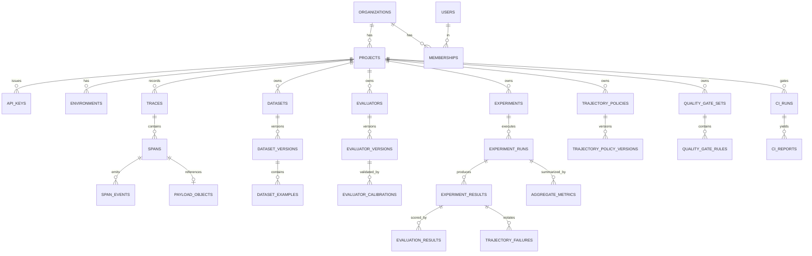

# Proofstep — Database Design

PostgreSQL 17. SQLAlchemy 2 (async, `psycopg3`), Alembic migrations.

## 0. Conventions

- **Primary keys:** UUIDv7 (`uuid` column, generated application-side). Time-ordered → good index locality, unlike UUIDv4; opaque → unlike bigserial, does not leak volume or allow enumeration.
- **Tenant column on every tenant-scoped table.** Every such table carries `project_id` (and `org_id` where a project join would otherwise be needed). Denormalized deliberately: it makes every index tenant-prefixed and makes a future RLS policy trivial.
- **Index prefix rule:** every index on a tenant-scoped table starts with `project_id`. A query that can't use it is a query that can scan another tenant's data.
- **Timestamps:** `timestamptz`, UTC, `created_at` non-null default `now()`. `updated_at` only on mutable tables.
- **Soft delete** (`deleted_at`) for user-facing containers (projects, datasets, evaluators, policies) so references from immutable experiments never dangle. **Hard delete** for payloads/traces under retention and for GDPR erasure. Never soft-delete something an audit trail must prove was removed.
- **JSONB** for open-world data (span attributes, example input/expected, evaluator config, metadata). Never for data that is filtered or joined at scale — those get real columns. Rule of thumb: *if it appears in a WHERE clause on the hot path, it is a column.*
- **Enums as `text` + CHECK constraint**, not PG `enum` types — adding a value to a PG enum inside a transaction with other DDL is a recurring migration hazard.
- **Money/scores:** scores are `double precision` in `[0,1]` where normalizable, plus a raw `value_json` for non-scalar results. Costs are `numeric(18,8)` — never floats.

## 1. Entity-relationship diagram

```
organizations
 └─< memberships >── users
 └─< projects
      ├─< environments
      ├─< api_keys
      ├─< traces ──< spans ──< span_events
      │      │        └──< payload_objects (by ref)
      │      └─< trace_tags
      ├─< datasets ──< dataset_versions ──< dataset_examples
      │                                        └─< dataset_example_revisions
      ├─< evaluators ──< evaluator_versions ──< evaluator_calibrations
      ├─< trajectory_policies ──< trajectory_policy_versions
      ├─< quality_gate_sets ──< quality_gate_rules
      ├─< prompt_versions
      ├─< model_configurations
      ├─< experiments ──< experiment_runs ──< experiment_results
      │                                          ├─< evaluation_results
      │                                          └─< trajectory_failures
      │                       └─< aggregate_metrics
      ├─< ci_runs ──< ci_reports
      ├─< review_queues ──< review_assignments
      ├─< annotations
      └─< audit_logs
```



## 2. Tables

### 2.1 Identity & tenancy

#### `organizations`
Purpose: top-level tenant boundary and billing/ownership unit (billing deferred).
Columns: `id` PK, `name`, `slug` UNIQUE, `created_at`, `deleted_at`.
Deletion: soft; cascade-purge job for hard erasure.

#### `users`
`id` PK, `email` CITEXT UNIQUE, `password_hash` (argon2id, nullable if OAuth-only later), `name`, `is_active`, `created_at`, `last_login_at`.
Never store plaintext passwords or tokens. Email is CITEXT to avoid case-duplicate accounts.

#### `memberships`
Join of user↔org with a role.
`id` PK, `org_id` FK, `user_id` FK, `role` text CHECK in (`owner`,`admin`,`developer`,`reviewer`,`viewer`), `created_at`.
UNIQUE `(org_id, user_id)`. Index `(user_id)` for "my orgs".
Partial unique index guaranteeing ≥1 owner is not expressible; enforce in application + a nightly integrity check.

#### `projects`
`id` PK, `org_id` FK, `name`, `slug`, `settings` JSONB, `default_capture_mode` text CHECK in (`full`,`redacted`,`metadata_only`,`disabled`) default `redacted`, `retention_days_traces` int default 30, `retention_days_payloads` int default 14, `online_eval_sample_rate` real default 0.01, `created_at`, `deleted_at`.
UNIQUE `(org_id, slug)` WHERE `deleted_at IS NULL`.

Note the defaults: capture is **redacted** and retention is **short** by default. Safe defaults are a security control, and a platform that stores model inputs and outputs must not default to hoarding them.

#### `environments`
`id` PK, `project_id` FK, `name` (`development`|`staging`|`production`|custom), `created_at`. UNIQUE `(project_id, name)`.
Modelled as a table rather than a free-text span attribute so retention, sampling, and gates can differ per environment.

#### `api_keys`
`id` PK, `project_id` FK, `environment_id` FK NULL, `name`, `prefix` char(12) UNIQUE (public, e.g. `ps_prod_a1b2`), `key_hash` bytea (**SHA-256 of the full key**, not bcrypt — see note), `scopes` text[] (`ingest`,`read`,`write`), `created_by` FK users, `created_at`, `last_used_at`, `expires_at`, `revoked_at`.
Index `(prefix)` UNIQUE; index `(project_id) WHERE revoked_at IS NULL`.

*Why SHA-256 and not argon2/bcrypt:* API keys are high-entropy (256-bit) random secrets, not user-chosen passwords, so brute force is infeasible and a slow KDF would add ~100 ms to **every ingest request**. Lookup is by `prefix`, then constant-time compare of the SHA-256 digest. Passwords, by contrast, use argon2id.

### 2.2 Traces

#### `traces`
One row per workflow execution.
`id` PK, `project_id` FK, `environment_id` FK, `trace_id` text (client-supplied, W3C 32-hex), `name`, `status` (`ok`,`error`,`unset`), `started_at`, `ended_at`, `duration_ms` int GENERATED, `span_count` int, `dropped_span_count` int default 0, `total_tokens` int, `total_cost` numeric(18,8), `error_category` text NULL, `git_commit` text NULL, `prompt_version_id` FK NULL, `model_config_id` FK NULL, `session_id` text NULL, `user_ref` text NULL (pseudonymous), `metadata` JSONB, `capture_mode` text, `created_at`.

UNIQUE `(project_id, trace_id)` — the idempotency anchor.
Indexes:
- `(project_id, started_at DESC)` — the default list query
- `(project_id, name, started_at DESC)` — per-workflow list
- `(project_id, status, started_at DESC)` WHERE `status='error'` (partial) — error triage
- `(project_id, git_commit)` — CI correlation
- GIN on `metadata` `jsonb_path_ops` — metadata filters

Aggregates (`span_count`, `total_tokens`, `total_cost`) are maintained incrementally on ingest, not computed at read time. Reading a trace list must never aggregate over spans.

#### `spans`
`id` PK, `project_id` FK, `trace_row_id` FK traces, `trace_id` text, `span_id` text (16-hex), `parent_span_id` text NULL, `name`, `span_type` text CHECK in (`agent`,`workflow`,`llm`,`tool`,`retriever`,`embedding`,`guardrail`,`evaluator`,`custom`), `status`, `status_message`, `started_at`, `ended_at`, `duration_ms`, `attributes` JSONB, `input_inline` JSONB NULL, `output_inline` JSONB NULL, `input_ref` FK payload_objects NULL, `output_ref` FK payload_objects NULL, `model` text NULL, `provider` text NULL, `prompt_tokens` int, `completion_tokens` int, `total_tokens` int, `cost` numeric(18,8), `tool_name` text NULL, `error_type` text NULL, `sequence_index` int, `created_at`.

UNIQUE `(project_id, trace_id, span_id)` — makes ingest idempotent via `ON CONFLICT DO UPDATE`.
Indexes:
- `(project_id, trace_row_id, started_at)` — fetch a trace's spans in order (the dominant query)
- `(project_id, span_type, started_at DESC)`
- `(project_id, tool_name, started_at DESC)` WHERE `tool_name IS NOT NULL` — tool analytics + policy queries
- `(project_id, model, started_at DESC)` WHERE `model IS NOT NULL`
- GIN on `attributes`

`parent_span_id` is intentionally **not** a foreign key: children can arrive before parents, and enforcing referential integrity would either reject valid data or force a two-phase write. Orphan detection is a read-time concern (render orphans under a synthetic root).

**Partitioning (designed now, enabled later):** create `spans` and `traces` as `PARTITION BY RANGE (started_at)` from the first migration, with monthly partitions and a `pg_partman`-style creation job. Doing this at v0.1 costs almost nothing; retrofitting partitioning onto a large live table costs a maintenance window. Retention then becomes `DROP PARTITION`, which is instant, instead of a `DELETE` that bloats the heap.

#### `span_events`
Point-in-time events within a span: retries, tool errors, guardrail triggers, streaming milestones.
`id` PK, `project_id`, `span_row_id` FK, `name`, `timestamp`, `attributes` JSONB.
Index `(project_id, span_row_id, timestamp)`.

*Do spans need a separate event table?* Yes, but only just. Events could be a JSONB array on the span. A separate table wins because (a) retries and guardrail triggers must be independently queryable for operational evaluators, (b) unbounded arrays inside a hot row cause TOAST rewrites on every append. Keep it; it is cheap.

#### `payload_objects`
Content-addressed pointer to object storage.
`id` PK, `project_id`, `sha256` bytea, `bucket`, `object_key`, `size_bytes`, `content_type`, `encoding` (`gzip`|`none`), `redaction_applied` bool, `created_at`, `expires_at`.
UNIQUE `(project_id, sha256)` — identical payloads (a repeated system prompt across 10 000 spans) are stored once. This is a large real saving, not a micro-optimization.
Index `(expires_at)` WHERE `expires_at IS NOT NULL` for the retention sweeper.
Deletion: hard. The sweeper deletes the S3 object then the row; an orphaned S3 object is reclaimed by a bucket lifecycle rule, so ordering failures are self-healing.

#### `trace_tags`
`id` PK, `project_id`, `trace_row_id` FK, `key`, `value`. UNIQUE `(trace_row_id, key)`. Index `(project_id, key, value)`.
Separate from `metadata` JSONB because tags are the low-cardinality, indexed, filterable dimension; metadata is the open blob.

### 2.3 Datasets

#### `datasets`
`id` PK, `project_id`, `name`, `slug`, `description`, `kind` text CHECK in (`golden`,`synthetic`,`adversarial`,`calibration`,`general`), `created_by`, `created_at`, `deleted_at`. UNIQUE `(project_id, slug)` WHERE not deleted.

#### `dataset_versions`
**Immutable once locked.**
`id` PK, `project_id`, `dataset_id` FK, `version` text (e.g. `v3`), `status` text CHECK in (`draft`,`locked`), `content_hash` bytea NULL, `example_count` int, `parent_version_id` FK self NULL (lineage/cloning), `split` text NULL (`train`,`dev`,`test`), `notes`, `created_by`, `created_at`, `locked_at` NULL.
UNIQUE `(dataset_id, version)`. Index `(project_id, dataset_id, created_at DESC)`.

Immutability enforcement, defence in depth:
1. Application layer rejects writes when `status='locked'`.
2. A `BEFORE UPDATE/DELETE` trigger on `dataset_examples` raises if the parent version is locked.
3. `content_hash` = SHA-256 over the canonical JSON (sorted keys, examples ordered by `ordinal`) of every example. Any tampering is detectable, and experiments store the hash, so a reproduced run can *prove* it used the same data.

Mutable fields on a locked version: only `notes`. Everything else is frozen.

#### `dataset_examples`
`id` PK, `project_id`, `dataset_version_id` FK, `ordinal` int, `external_id` text NULL (stable identity across versions — this is what lets you diff example-level results between v3 and v4), `input` JSONB, `expected` JSONB NULL, `metadata` JSONB, `source_trace_id` text NULL, `source_span_id` text NULL, `created_at`.
UNIQUE `(dataset_version_id, ordinal)`; UNIQUE `(dataset_version_id, external_id)` WHERE `external_id IS NOT NULL`.
Index `(project_id, dataset_version_id, ordinal)`.

#### `dataset_example_revisions`
Append-only audit of edits made while a version is a draft, plus reviewer corrections.
`id` PK, `project_id`, `example_id` FK, `revision` int, `input` JSONB, `expected` JSONB, `changed_by`, `change_reason`, `created_at`. UNIQUE `(example_id, revision)`.

### 2.4 Evaluators

#### `evaluators`
`id` PK, `project_id`, `name`, `slug`, `evaluator_type` text CHECK in (`exact_match`,`json_schema`,`regex`,`contains`,`numeric_range`,`set_comparison`,`custom_python`,`business_rule`,`statistical`,`embedding_similarity`,`llm_judge`,`trajectory`,`security`,`operational`), `description`, `created_at`, `deleted_at`. UNIQUE `(project_id, slug)`.

#### `evaluator_versions`
**Immutable.** `id` PK, `project_id`, `evaluator_id` FK, `version` int, `config` JSONB (schema, regex list, rubric text, thresholds, judge model + params, policy ref), `config_hash` bytea, `judge_model` text NULL, `judge_params` JSONB NULL, `code_ref` text NULL (git path + sha for custom python), `output_kind` text CHECK in (`binary`,`score`,`categorical`,`numeric`), `created_by`, `created_at`.
UNIQUE `(evaluator_id, version)`; UNIQUE `(evaluator_id, config_hash)` prevents accidentally minting a "new version" that is byte-identical to an old one.

Everything about an evaluator that could change a score lives in the version row — including the judge model id and temperature. A judge whose model silently upgrades underneath you is a reproducibility bug, and pinning it here is the fix.

#### `evaluator_calibrations`
`id` PK, `project_id`, `evaluator_version_id` FK, `calibration_dataset_version_id` FK, `n_examples` int, `agreement` real, `cohens_kappa` real, `false_pass_rate` real, `false_fail_rate` real, `precision` real, `recall` real, `f1` real, `confusion_matrix` JSONB, `per_class` JSONB, `mean_cost` numeric(18,8), `p95_latency_ms` int, `judge_model` text, `created_at`.
Index `(project_id, evaluator_version_id, created_at DESC)`.

### 2.5 Policies & gates

#### `trajectory_policies` / `trajectory_policy_versions`
`trajectory_policies`: `id`, `project_id`, `name`, `slug`, `description`, timestamps, `deleted_at`. UNIQUE `(project_id, slug)`.
`trajectory_policy_versions`: `id`, `project_id`, `policy_id` FK, `version` int, `source_yaml` text (verbatim — always store the original text, not only the parsed form, so error messages can point at line numbers), `parsed` JSONB, `content_hash` bytea, `created_by`, `created_at`. UNIQUE `(policy_id, version)`.

#### `quality_gate_sets` / `quality_gate_rules`
`quality_gate_sets`: `id`, `project_id`, `name`, `version` int, `source_yaml` text, `created_at`. UNIQUE `(project_id, name, version)`.
`quality_gate_rules`: `id`, `project_id`, `gate_set_id` FK, `metric_key` text, `minimum` real NULL, `maximum` real NULL, `max_absolute_regression` real NULL, `max_relative_regression` real NULL, `blocking` bool default true, `protected` bool default false, `severity` text CHECK in (`block`,`warn`), `applies_to_slice` JSONB NULL (e.g. `{"class":"unsubscribe"}`).
UNIQUE `(gate_set_id, metric_key, coalesce(applies_to_slice,'{}'))`.

`applies_to_slice` is what makes protected-class gating possible: a rule can target `per_class_recall` for `unsubscribe` specifically rather than the macro average.

### 2.6 Experiments

#### `experiments`
The *definition*: what is being tested.
`id` PK, `project_id`, `environment_id`, `name`, `suite_name` text, `dataset_version_id` FK, `dataset_content_hash` bytea, `task_ref` text (`module:function`), `task_version` text, `prompt_version_id` FK NULL, `model_config_id` FK NULL, `evaluator_version_ids` uuid[], `policy_version_ids` uuid[], `gate_set_id` FK NULL, `git_commit` text, `git_branch` text, `git_dirty` bool, `dependency_lock_hash` text, `config` JSONB, `is_baseline` bool default false, `baseline_label` text NULL, `created_by`, `created_at`.
Indexes: `(project_id, suite_name, created_at DESC)`; `(project_id, git_branch, created_at DESC)`; partial `(project_id, suite_name) WHERE is_baseline`.

Immutable after creation except `is_baseline`/`baseline_label` (promotion is a curation act, not a data change).

#### `experiment_runs`
The *execution*: an experiment can be re-run (e.g. to measure judge variance).
`id` PK, `project_id`, `experiment_id` FK, `attempt` int, `status` text CHECK in (`pending`,`running`,`succeeded`,`failed`,`cancelled`,`partial`), `trigger` text (`cli`,`ci`,`ui`,`schedule`), `started_at`, `ended_at`, `total_examples`, `completed_examples`, `failed_examples`, `total_cost` numeric(18,8), `runner` text, `runner_version` text, `error` text NULL, `cancelled_at`, `created_at`. UNIQUE `(experiment_id, attempt)`.

Splitting definition from run is what makes "resume", "retry failed cases", and "partial completion" expressible without mutating history.

#### `experiment_results`
One row per example per run. **Append-only.**
`id` PK, `project_id`, `run_id` FK, `example_id` FK, `external_id` text, `status` (`ok`,`error`,`timeout`,`skipped`), `output` JSONB NULL, `output_ref` FK payload_objects NULL, `trace_id` text NULL, `latency_ms` int, `tokens` int, `cost` numeric(18,8), `error` text NULL, `retry_count` int, `created_at`.
UNIQUE `(run_id, example_id)`. Index `(project_id, run_id, status)`.

#### `evaluation_results`
One row per (result × evaluator version). Also used for online evaluation, where `run_id` is NULL and `trace_row_id` is set.
`id` PK, `project_id`, `experiment_result_id` FK NULL, `trace_row_id` FK NULL, `span_row_id` FK NULL, `evaluator_version_id` FK, `score` double precision NULL, `passed` bool NULL, `label` text NULL, `value_json` JSONB NULL, `reasoning` text NULL, `confidence` real NULL, `cost` numeric(18,8), `latency_ms` int, `evaluator_trace_id` text NULL, `created_at`.
CHECK: exactly one of `experiment_result_id` / `trace_row_id` is non-null.
Indexes `(project_id, experiment_result_id)`, `(project_id, evaluator_version_id, created_at DESC)`, `(project_id, trace_row_id)`.

`evaluator_trace_id` means judge calls are themselves traced — you can debug a judge the same way you debug the app. This matters more than it sounds: most judge disputes are resolved by reading the judge's own prompt.

#### `trajectory_failures`
`id` PK, `project_id`, `experiment_result_id` FK NULL, `trace_row_id` FK NULL, `policy_version_id` FK, `rule_id` text (stable id within the policy), `rule_kind` text (`required_order`,`forbidden`,`limit`,`condition`,`required_tool`,`arg_condition`,`loop`,`final_state`), `severity`, `message` text, `offending_span_id` text NULL, `offending_span_row_id` FK NULL, `expected` JSONB, `actual` JSONB, `event_index` int NULL, `created_at`.
Index `(project_id, policy_version_id, created_at DESC)`, `(project_id, rule_id)`.

Storing the offending span *and* the event index is what turns "policy failed" into a clickable, debuggable finding.

#### `aggregate_metrics`
Precomputed per-run rollups so comparison is a cheap join, not a re-aggregation.
`id` PK, `project_id`, `run_id` FK, `metric_key` text, `slice` JSONB NULL, `value` double precision, `count` int, `stddev` real NULL, `ci_low` real NULL, `ci_high` real NULL, `unit` text, `created_at`.
UNIQUE `(run_id, metric_key, coalesce(slice,'{}'))`.

### 2.7 CI

#### `ci_runs`
`id` PK, `project_id`, `provider` text (`github`), `repository`, `pr_number` int NULL, `commit_sha`, `branch`, `workflow_run_id` text, `candidate_run_id` FK experiment_runs, `baseline_run_id` FK experiment_runs NULL, `gate_set_id` FK, `verdict` text (`pass`,`fail`,`warn`,`error`), `blocking_failures` JSONB, `created_at`.
Index `(project_id, repository, pr_number, created_at DESC)`, `(project_id, commit_sha)`.

#### `ci_reports`
`id` PK, `project_id`, `ci_run_id` FK, `format` (`json`,`markdown`,`html`), `payload_ref` FK payload_objects, `summary_markdown` text, `created_at`.

### 2.8 Human review

#### `annotations`
`id` PK, `project_id`, `target_type` text CHECK in (`trace`,`span`,`experiment_result`,`dataset_example`), `target_id` uuid, `annotator_id` FK users, `label` text NULL, `rating` real NULL, `comment` text NULL, `correction` JSONB NULL, `preference_target_id` uuid NULL (pairwise), `preference_winner` text NULL, `created_at`, `updated_at`.
Index `(project_id, target_type, target_id)`, `(project_id, annotator_id, created_at DESC)`.
Polymorphic `target_id` has no FK — accepted trade-off; integrity is checked by a nightly job. The alternative (four nullable FK columns) makes every query uglier for marginal gain.

#### `review_queues`, `review_assignments`
`review_queues`: `id`, `project_id`, `name`, `filter` JSONB (what routes into it), `created_at`.
`review_assignments`: `id`, `project_id`, `queue_id` FK, `target_type`, `target_id`, `assignee_id` FK NULL, `status` (`pending`,`in_review`,`done`,`skipped`), `priority` int, `claimed_at`, `completed_at`.
Index `(project_id, queue_id, status, priority DESC)`. UNIQUE `(queue_id, target_type, target_id)`.

### 2.9 Config & audit

#### `prompt_versions`
`id`, `project_id`, `name`, `version` text, `template` text, `template_hash` bytea, `variables` JSONB, `created_at`. UNIQUE `(project_id, name, version)`.
Deliberately minimal — this is *reference data for reproducibility*, not a prompt-management product (an explicit non-goal).

#### `model_configurations`
`id`, `project_id`, `provider`, `model`, `params` JSONB (temperature, top_p, max_tokens, seed), `config_hash` bytea, `created_at`. UNIQUE `(project_id, config_hash)`.

#### `audit_logs`
Append-only. `id`, `org_id`, `project_id` NULL, `actor_type` (`user`,`api_key`,`system`), `actor_id`, `action` text, `resource_type`, `resource_id`, `metadata` JSONB, `ip` inet, `user_agent`, `created_at`.
Index `(org_id, created_at DESC)`, `(project_id, resource_type, resource_id)`.
Insert-only: no UPDATE/DELETE grants for the application role. Retention 400 days, separate from trace retention.

## 3. Tenant isolation strategy

Three layers, because one is never enough:

1. **Query layer.** All data access goes through repository classes that take an authenticated `TenantContext(org_id, project_id)` and inject the predicate. No raw session usage in route handlers — enforced by a lint rule and code review.
2. **Test layer.** A parameterized cross-tenant suite hits every read/write endpoint with a foreign project's key and asserts 404. New endpoints are added to a registry; a test fails if an endpoint exists that the suite doesn't cover. This is the control that actually catches regressions.
3. **Database layer (Phase 12).** Postgres RLS policies on tenant-scoped tables keyed off `current_setting('proofstep.project_id')`, set per transaction. Deferred but not designed-out — the ubiquitous `project_id` column is what makes it a one-migration change. RLS is the backstop for a bug in layer 1, not a substitute for it.

## 4. Retention & deletion

| Data | Default | Mechanism |
|---|---|---|
| Payload objects | 14 days | `expires_at` sweeper + S3 lifecycle |
| Spans/traces | 30 days | Partition drop |
| Experiment results | Indefinite | Small, and they *are* the history |
| Aggregate metrics | Indefinite | Tiny |
| Audit logs | 400 days | Partitioned by month |
| Annotations | Indefinite | Human labour is the most expensive data here |

GDPR erasure by `user_ref`: a job hard-deletes matching payloads and nulls `user_ref`, recording the erasure in the audit log. Aggregates survive (they are non-identifying), which is both correct and necessary — otherwise erasure rewrites history.

## 5. Expected query patterns

| # | Query | Serving index |
|---|---|---|
| 1 | Trace list, filtered by env/status/time, paginated | `(project_id, started_at DESC)` + partial indexes; keyset pagination on `(started_at, id)` |
| 2 | All spans for a trace, ordered | `(project_id, trace_row_id, started_at)` |
| 3 | Error traces last 24 h | partial `WHERE status='error'` |
| 4 | Metric comparison for two runs | `aggregate_metrics` UNIQUE index; a single two-row-set join |
| 5 | Per-example regressions between runs | join `experiment_results` on `external_id` across two `run_id`s |
| 6 | Judge results for one evaluator version over time | `(project_id, evaluator_version_id, created_at DESC)` |
| 7 | Policy violation counts by rule | `(project_id, policy_version_id, created_at DESC)` |
| 8 | Review queue next item | `(project_id, queue_id, status, priority DESC)` |
| 9 | Traces by git commit (CI correlation) | `(project_id, git_commit)` |
| 10 | Metadata filter | GIN `jsonb_path_ops` |

**Pagination is keyset, never OFFSET.** `OFFSET 10000` on a trace table is a full scan, and trace lists are the most-hit endpoint in the product.

## 6. JSONB policy

Use JSONB for: span `attributes`, example `input`/`expected`/`metadata`, evaluator `config`, gate `applies_to_slice`, `confusion_matrix`, parsed policies.
Do **not** use JSONB for: status, type, model name, tool name, cost, tokens, timestamps, or anything in a hot `WHERE`/`ORDER BY`. Those are columns with indexes.
Cap: reject any single JSONB value over 1 MiB at the API layer; overflow goes to `payload_objects`. Unbounded JSONB is how ingestion tables die.

## 7. Migration notes

- Alembic, one migration per PR, always reversible (`downgrade` implemented and tested in CI by upgrade→downgrade→upgrade on a scratch DB).
- Create partitioned tables from the first migration even though only one partition exists.
- `CREATE INDEX CONCURRENTLY` for any index added after v0.1 on `spans`/`traces` (requires `autocommit_block()` in Alembic).
- Never rename a column in one migration; add → backfill → dual-write → drop across releases.
