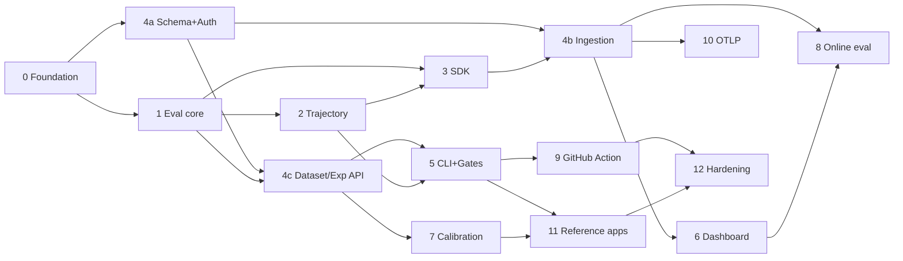

# Proofstep — Phased Implementation Plan

Complexity scale: **S** (one focused PR) · **M** (2–4 PRs) · **L** (5–10 PRs) · **XL** (split it further before starting). No calendar estimates.

Sequencing principle: **each phase must be independently useful.** Phases 0–2 alone produce a standalone local eval framework someone would use even if we shipped nothing else. Nothing is built that a later phase merely *might* need.

The phase order in the brief is close to right, with two changes argued below:
- **Phase 7 (trajectory) moves earlier, to run alongside Phase 3.** It is the differentiator, it is a pure library with no dependency on the server, and discovering that trajectory normalization is harder than expected in Phase 7 of 12 would be a bad surprise. Building it early de-risks the product thesis.
- **Phase 6 (LLM evaluators) splits:** basic judges land in Phase 1 (a suite without a judge isn't representative); calibration is its own later phase.

---

## Phase 0 — Repository & development foundation · **M**

**Objective.** A contributor clones, runs one command, and has a working, linted, tested environment.
**User-visible outcome.** `make setup && make test` passes on a clean machine.

**Affected.** Root `pyproject.toml` (uv workspace), `pnpm-workspace.yaml`, `.gitignore`, `LICENSE` (Apache-2.0), `README.md`, `CONTRIBUTING.md`, `Makefile`, `.pre-commit-config.yaml`, `.github/workflows/ci.yml`, `docker-compose.yml`, `infra/docker/`, `.env.example`, `ruff.toml`, `mypy.ini`, `.importlinter`.

DB: none. API: none. Frontend: none.
**Tests.** CI green on an empty test suite; `docker compose up` brings up Postgres/Redis/MinIO with health checks.
**Acceptance.** Fresh clone → `make setup` → `make test` → `make dev` all succeed; pre-commit blocks a lint violation; the import-linter contract and the "no davis/adaptquiz in apps|packages" check exist and pass.
**Depends on.** Nothing. **Risks.** Tooling yak-shaving — timebox strictly; defer anything not needed to run a test.

---

## Phase 1 — Local evaluation core · **L**

**Objective.** A pure, dependency-light library that runs a dataset through a task with evaluators and produces gated results. **This is the load-bearing milestone.**
**User-visible outcome.** A developer runs `python -m proofstep.examples.basic` and gets a scored report with an exit code — no server, no account.

**Affected.** `packages/shared-types/`, `packages/evaluation-core/` (`types.py`, `dataset.py`, `runner.py`, `evaluators/{deterministic,statistical,judge,operational}.py`, `aggregate.py`, `gates.py`, `compare.py`, `report.py`), `examples/basic-llm/`.

DB: none. API: none. Frontend: none.
**Tests.** ~250 unit tests; the whole §2 unit list in `TESTING_STRATEGY.md` minus policy/trace items; `FakeModelClient` for judges; **E2E-1 written here against a local-only stub**.
**Acceptance.** `evaluate(dataset, task, evaluators)` runs sync+async tasks with bounded concurrency, per-example timeouts, retries, journaling, and cancellation; deterministic + statistical + judge + operational evaluators implemented; gates produce correct verdicts and exit codes; the hidden-regression scenario is a passing named test; ≥90 % coverage.
**Depends on.** Phase 0. **Risks.** Over-abstracting the evaluator protocol before three real evaluator families exist — write the deterministic ones first, extract the protocol from them.

---

## Phase 2 — Trajectory policy engine · **L**  *(moved earlier)*

**Objective.** Policy YAML → parsed policy; trace → normalized events; rules → attributed failures.
**User-visible outcome.** `proofstep policies test policy.yaml trace.json` prints span-attributed violations.

**Affected.** `packages/trajectory-engine/` (`schema.py`, `parser.py`, `normalize.py`, `predicates.py`, `matchers/`, `result.py`), `evals/policies/`, `evals/fixtures/trajectories/`, plus a `trajectory` evaluator adapter in `evaluation-core`.

DB: none. API: none. Frontend: none.
**Tests.** One fixture per normalization rule (§4 of `TRAJECTORY_POLICIES.md`); all 12 rule kinds positive + negative; the ~40-fixture golden corpus that later powers the local↔server contract test; parse-error line numbers; predicate AST rejects calls/imports/attribute traversal.
**Acceptance.** The Davis policy from the docs evaluates correctly against both a compliant and a violating fixture trace; every failure carries rule id, message, offending span id, event index, and policy line; incomplete traces yield `inconclusive` for `required_*` and still evaluate `forbidden_*`; parse errors point at a line.
**Depends on.** Phase 1 (for the evaluator adapter and the trace data model). **Risks.** Normalization ambiguity — this is why it moved early. Write the fixture corpus *before* the matchers.

---

## Phase 3 — Python tracing SDK · **L**

**Objective.** Capture traces from a real application with negligible overhead and no failure modes that reach the host app.
**User-visible outcome.** Decorate a function; get a trace object (printed locally, exported later).

**Affected.** `packages/python-sdk/` (`__init__.py`, `client.py`, `context.py`, `span.py`, `decorators.py`, `_telemetry/{buffer,exporter,batch,retry,spool}.py`, `redaction/`, `sampling.py`, `propagation.py`).

DB: none. API: consumes `/v1/ingest` (stubbed until Phase 4). Frontend: none.
**Tests.** Contextvar propagation through `gather`/`TaskGroup`/threads; sync+async decorators; exception handling preserves the original traceback; the full redaction corpus in four capture modes; buffer overflow drops oldest and counts; exporter backoff and spool/replay; **overhead benchmark asserting < 5 ms p99 added latency with the API unreachable**; a chaos test killing the endpoint mid-run.
**Acceptance.** Nested spans build a correct tree; `@proofstep.tool` produces policy-ready events (verified by feeding SDK output straight into the Phase 2 engine); the SDK never raises; secrets never appear in exported bytes.
**Depends on.** Phase 1 (span model in `shared-types`), Phase 2 (event shape). **Risks.** Async context edge cases — test matrix over every spawning primitive.

---

## Phase 4 — Persistence, API, and ingestion · **XL → split into 4a/4b/4c**

### 4a — Schema, auth, projects · **L**
Alembic baseline with **partitioned** `traces`/`spans`; orgs/users/memberships/projects/environments/api_keys; auth endpoints; repository layer with tenant injection; audit logging; error model; rate limiting; `/healthz`, `/readyz`.
**Acceptance.** Register → login → create project → issue key → key authenticates; cross-tenant suite green; migration up/down/up green; models↔migration in sync.

### 4b — Trace ingestion & read APIs · **L**
`POST /v1/ingest/traces|spans` with idempotent upsert, partial acceptance, S3 offload, content-addressed dedupe; trace list/detail/spans/export with keyset pagination.
**Acceptance.** SDK → API → DB round-trip; replay is idempotent; 10 000-span trace ingests within limits; oversize → S3; trace-list p95 < 300 ms on a 10 M-span seed.

### 4c — Dataset, evaluator, experiment APIs · **L**
Datasets/versions/examples with lock + content hash + trigger; evaluator registry; experiments/runs/results/aggregates; `POST /experiments/compare`; gate sets; `ci_runs`.
**Acceptance.** Lock is idempotent and rejects post-lock writes at both app and DB layers; compare returns metric deltas, gate verdicts, and per-example regressions; server gate verdicts byte-match the library's on the golden corpus.

**Depends on.** 4a ← Phase 0; 4b ← 4a + Phase 3; 4c ← 4a + Phase 1.
**Risks.** Scope. Ship 4a and 4b behind a feature-flagged deploy; do not start 4c until 4b's contract tests are green.

---

## Phase 5 — CLI & quality gates · **M**

**Objective.** The command that makes this a CI tool.
**User-visible outcome.** `proofstep eval suite.yaml --baseline main` → table, JSON, exit code.

**Affected.** `packages/cli/` (`main.py`, `commands/`, `config.py`, `suite/{schema,loader,validate}.py`, `render/{terminal,json}.py`, `baseline.py`), `evals/suites/`.
**Tests.** Suite schema validation incl. every semantic rule; env interpolation; `extends`; `--set`; baseline resolution strategies; report JSON-Schema contract; exit-code matrix; `--dry-run` makes zero model calls; `--resume`/`--only-failed`; snapshot tests of terminal output with colour off.
**Acceptance.** Full local run against a fixture suite; `--local` makes zero Proofstep network calls; results upload and appear in the API; exit 1 on a blocking regression, 0 on warn; report validates against its schema.
**Depends on.** Phases 1, 2, 3, 4c. **Risks.** Suite-format churn — freeze the schema behind `apiVersion` and version it from the first release.

---

## Phase 6 — Trace dashboard · **L**

**Objective.** See what happened.
**Affected.** `apps/web/` — app shell, auth pages, project switcher, trace list with filters + keyset pagination, trace detail with a **virtualized** span waterfall, span inspector (input/output/attributes/tokens/cost), evaluation results panel, trajectory-failure display with span links, generated API types.
**Tests.** Playwright: list, filter, open a trace, expand spans, view a payload, see a policy failure linked to its span; XSS corpus rendered safely; virtualization at 10 000 spans; TTI < 2.5 s on a 1 M-span seed.
**Acceptance.** A trace sent in Phase 3 is fully inspectable; filters compose; a trajectory failure is one click from its offending span.
**Depends on.** 4b. **Risks.** Waterfall performance — build the virtualized renderer first, against a 10 000-span fixture, before any styling.

---

## Phase 7 — Evaluator calibration · **M**

**Objective.** Make judges trustworthy, or make their untrustworthiness visible.
**Affected.** `evaluation-core/calibration.py`, `apps/worker/jobs/calibrate.py`, calibration API + UI, `evals/calibration/`.
**Tests.** Metric math against hand-built matrices (κ verified against a published example); false-pass/false-fail direction correctness; the adversarial-rubric test; position-bias detection; human-human ceiling reporting.
**Acceptance.** Calibrating a judge version against a labelled set produces a stored report; `require_calibration` in a gate set turns an uncalibrated or under-performing judge into a CI error; an uncalibrated judge always emits a visible warning.
**Depends on.** Phases 1, 4c. **Risks.** Nobody builds calibration datasets — mitigate by shipping one for each reference suite and making the CI warning loud.

---

## Phase 8 — Online evaluation & annotation · **M**

**Objective.** Production traces get checked; humans turn failures into datasets.
**Affected.** `apps/worker/jobs/{online_eval,rollup,retention}.py`, sampling config, review queues + annotation API and UI, `promote-from-trace`.
**Tests.** 100 % deterministic coverage of ingested traces; sampling rate accuracy; failure-triggered escalation; queue claiming under concurrency (`SKIP LOCKED`); promotion creates a draft version, never mutating a locked one; retention sweeper and partition drop.
**Acceptance.** A production trace violating a policy appears in a review queue; a reviewer annotates and promotes it; the example appears in the next dataset version; judge cost stays within the configured sample rate.
**Depends on.** Phases 2, 4b, 4c, 6.

---

## Phase 9 — GitHub Actions integration · **M**

**Objective.** The loop closes in CI.
**Affected.** `.github/actions/proofstep-action/`, report→markdown renderer, `ci_runs`/`ci_reports` wiring, docs for the fork-PR secret pattern.
**Tests.** Markdown snapshot; comment upsert (one comment, edited, never appended); comment posts on run failure; artifact upload; exit-code propagation; comment-length truncation at the boundary.
**Acceptance.** A demo PR with a seeded regression shows a red check and a comment naming the blocking metric with a link to the experiment; re-running updates the same comment.
**Depends on.** Phase 5, 4c.

---

## Phase 10 — OTLP receiver & LangGraph adapter · **M**

`POST /v1/otlp/v1/traces`, OpenInference mapping table, Collector config in `infra/otel/`, `examples/langgraph-agent/`.
**Acceptance.** An app instrumented with plain OpenTelemetry + OpenInference appears in the dashboard with correct span types and token counts, with no Proofstep SDK installed. Round-trip contract test green.
**Depends on.** 4b.

---

## Phase 11 — Reference integrations · **M** (two parallel tracks)

`examples/davis-sdr/` + `evals/suites/davis-*.yaml` + `evals/policies/` (six suites per `REFERENCE_SUITES.md`); `examples/adaptquiz/` + four suites.
**Acceptance.** Each reference suite runs end to end against fixture data and produces a gated report; every suite ships a calibration set for its judges; a CI check confirms no domain term leaked into `apps/` or `packages/`.
**Depends on.** Phases 5, 7. **Risks.** Domain logic leaking into the platform — the automated check is the control, not discipline.

---

## Phase 12 — Hardening, docs, launch · **L**

RLS policies; the full security suite; load tests against the stated targets; queue observability + DLQ handling; graceful degradation paths; retention automation; `proofstep doctor`; docs site (quickstart, concepts, SDK/CLI reference, self-hosting, security, evaluation-methodology guide); one-command demo with seeded data.
**Acceptance.** All `TESTING_STRATEGY.md` §8 targets met and recorded; the security suite is green; a new user completes the quickstart in under 15 minutes without reading source; `docker compose up` yields a working demo in under two minutes.

---

## Dependency graph

**Critical path to a demonstrable MVP:** 0 → 1 → 2 → 3 → 4a → 4b → 4c → 5 → 6 → 9. Phases 7, 8, 10, 11 are parallelizable once 4c lands.

**Suggested first three deliverables:** Phase 0 (M), then Phase 1 split as 1a deterministic evaluators + runner, 1b judges + aggregation, 1c gates + comparison.
